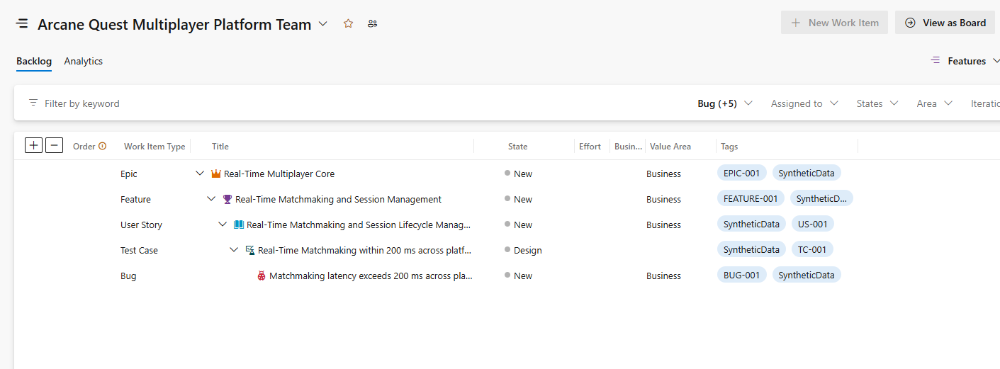

# Synthetic Azure DevOps Test Data Generator

## Overview

The **Synthetic Azure DevOps Test Data Generator** is a Python-based application that generates realistic Azure DevOps project artifacts using Large Language Models (LLMs).

The primary goal of this project is to create synthetic yet realistic software development data that can be imported into Azure DevOps. This data can then be used for:

* Building Retrieval-Augmented Generation (RAG) applications
* Testing AI-powered Quality Engineering tools
* Demonstrating Azure DevOps workflows
* Learning Azure DevOps REST APIs
* Creating enterprise-like datasets without exposing real customer data

The generator accepts a **business domain** (for example, Banking, Insurance, Healthcare, or E-Commerce) and automatically creates a structured project hierarchy.

# End Results

---
# Project Workflow

```text
User Input (Business Domain)
            │
            ▼
            LLMs
            │
            ▼
 Generate Azure DevOps Artifacts
            │
            ▼
      Export as JSON Files
            │
            ▼
 Import into Azure DevOps
      (REST API + PAT Token)
```

---

# Features

The application generates the following Azure DevOps artifacts:

* Project
* Epics
* Features
* User Stories
* Acceptance Criteria
* Manual Test Cases
* Bugs
* Traceability Relationships

Future enhancements may include:

* Test Plans
* Test Suites
* Test Runs
* Automation Test Mappings
* Sprint Data
* Area Paths
* Iteration Paths

---

# Example

### Input

```text
Domain:
Banking
```

### Generated Output

```text
Project
│
├── Epic
│      ├── Feature
│      │      ├── User Stories
│      │      │      ├── Acceptance Criteria
│      │      │      ├── Manual Test Cases
│      │      │      └── Bugs
```

---

# Project Structure

```text
SyntheticAzureDevOpsGenerator/
│
├── app.py
├── settings.py
├── requirements.txt
├── .env
│
├── prompts/
│
├── generator/
│
├── azure/
│
├── output/
│
└── utils/
```

---

# Technology Stack

| Component         | Technology                             |
| ----------------- | -------------------------------------- |
| Language          | Python                                 |
| LLM Provider      | NVIDIA NIM (OpenRouter optional)       |
| LLM Models        | NVIDIA-hosted open models              |
| HTTP Client       | requests                               |
| Configuration     | python-dotenv                          |
| Data Validation   | Pydantic                               |
| Output Format     | JSON                                   |
| Azure Integration | Azure DevOps REST API                  |

---

# Prerequisites

* Python 3.12 or later
* NVIDIA API Key
* Azure DevOps Personal Access Token (PAT)
* Azure DevOps Organization
* Azure DevOps Project (or permissions to create one)

---

# Installation

Clone the repository:

```bash
git clone <repository-url>
cd SyntheticAzureDevOpsGenerator
```

Create a virtual environment:

```bash
python -m venv .venv
```

Activate the environment:

### Windows

```bash
.venv\Scripts\activate
```

### Linux / macOS

```bash
source .venv/bin/activate
```

Install dependencies:

```bash
pip install -r requirements.txt
```

---

# Environment Variables

Create a `.env` file in the project root.

```env
LLM_PROVIDER=nvidia
NVIDIA_API_KEY=your_nvidia_api_key
NVIDIA_BASE_URL=https://integrate.api.nvidia.com/v1
NVIDIA_MODEL=meta/llama-3.3-70b-instruct
LLM_TIMEOUT_SECONDS=180
LLM_MAX_RETRIES=2
LOG_LEVEL=INFO

# Optional OpenRouter fallback configuration
OPENROUTER_API_KEY=your_openrouter_api_key
OPENROUTER_MODEL=your_openrouter_model

AZURE_DEVOPS_ORG=https://dev.azure.com/your-organization

AZURE_DEVOPS_PAT=your_personal_access_token

AZURE_DEVOPS_PROCESS_TEMPLATE_ID=your_process_template_id
```

---

# Running the Application

```bash
python app.py
```

Project and work-item creation requires an Azure DevOps PAT with the
`vso.project_manage` and `vso.work_write` scopes. All generated artifacts are
saved under `output/` before the Azure DevOps project creation request is sent.

Example:

```text
Enter Business Domain:

Insurance Claim Processing
```

The application will generate synthetic Azure DevOps artifacts and save them as JSON files.

The free-tier optimized default dataset generates 1 Project, 1 Epic, 1 Feature,
1 User Story, 3 Test Cases, and 1 Bug. A Story can contain at most 5 Test Cases
and 5 Bugs. These counts are constructor options on `SyntheticDataEngine`, but
the caps prevent oversized responses when using free LLM endpoints.

Every LLM response is parsed into a strict Pydantic model. Invalid fields,
types, enum values, collection counts, or acceptance-criteria coverage trigger
a bounded correction request. The complete dataset is validated again for
unique IDs and parent-child references before any file is saved or Azure API
write is attempted.

When using `openrouter/free`, the router can select models with different output
limits. Test Cases are therefore generated in small batches, one acceptance
criterion at a time, instead of requesting one large nested response. Keeping
the output limit at 4096 is normally sufficient for these batches. For more
predictable behavior without a paid model, configure a specific `:free` model
instead of the rotating `openrouter/free` router.

---

# Output

The generated files will be stored inside the `output/` directory.

Example:

```text
output/
│
├── project.json
├── epics.json
├── features.json
├── stories.json
├── acceptance_criteria.json
├── testcases.json
├── bugs.json
└── traceability.json
```

---

# Azure DevOps Import

Once the JSON files are generated, the application can upload them into Azure DevOps using the Azure DevOps REST API.

The import process follows this order:

1. Project
2. Epics
3. Features
4. User Stories
5. Test Cases
6. Bugs
7. Work Item Relationships

This ensures parent-child relationships are maintained correctly.

The Azure DevOps project is the container. Inside it, work items are uploaded
in this hierarchy:

```text
Epic
└── Feature
      └── User Story
            └── Test Case
                  └── Bug
```

Acceptance criteria are stored on their User Story and also exported to
`output/acceptance_criteria.json`. Test Cases receive both a parent link and
Azure DevOps' native Tests link to their User Story. The synthetic-to-Azure ID
mapping is saved to `output/azure_upload.json`.

---

# Future Roadmap

* Support additional LLM providers
* Configurable project sizes (Small, Medium, Large)
* Multiple business domain templates
* Validation of generated artifacts
* Duplicate detection
* Coverage gap generation
* Azure DevOps Test Plans support
* Synthetic execution history
* RAG-ready document generation
* Web interface (Streamlit or FastAPI)

---

# Acknowledgements

This project is inspired by real-world Quality Engineering workflows and aims to simplify the creation of realistic Azure DevOps datasets for AI, RAG, and software testing research.
